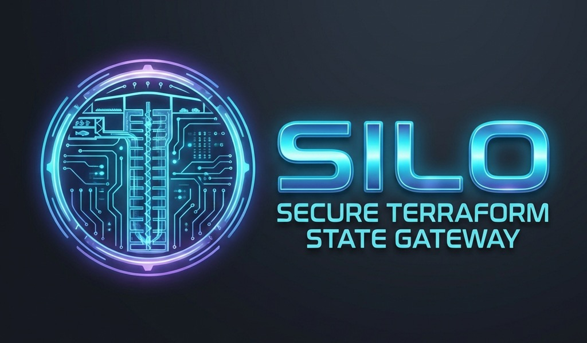

<p align="center">
  
</p>

# Silo: Secure Terraform State Gateway

Silo is a secure, mTLS-enabled gateway for Terraform/OpenTofu state, built on top of [Pingora](https://github.com/cloudflare/pingora). It provides centralized governance, locking, and atomic state protection for infrastructure-as-code.

## Quickstart

The fastest way to experience Silo is to use the quickstart script. This will start a local Vault dev server, launch Silo, and prepare a Terraform project for you.

```bash
# Clone the repository
git clone https://github.com/StanleyXie/silo.git
cd silo

# Run the quickstart
./quickstart.sh
```

## Features

- **mTLS by Default**: Automatic certificate generation and enforcement for all clients.
- **Identity-Based Authorization**: RBAC for your Terraform states based on client certificate Common Names.
- **Pluggable Storage**: Support for Vault (production) and Etcd (distributed) backends.
- **Atomic Writes**: Native support for Check-And-Set (CAS) to prevent state corruption.
- **Observability**: Prometheus metrics and structured transactional logging.

## Installation (macOS)

```bash
brew install StanleyXie/tap/silo
```

## Local Testing

You can run the full test matrix to validate your local environment:

```bash
bash scripts/test_matrix.sh
```

## License

MIT
